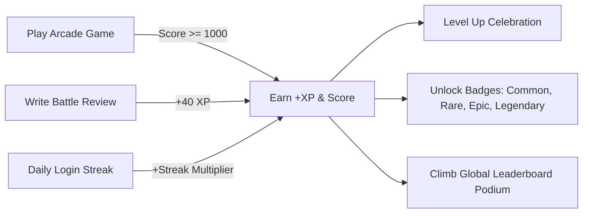

# 🚀 Galactic Squad - Next-Gen AI Gaming Arcade & Platform

[](https://reactjs.org/)
[](https://vitejs.dev/)
[](https://tailwindcss.com/)
[](https://nodejs.org/)
[](https://expressjs.com/)
[](https://www.mongodb.com/)
[](https://groq.com/)
[](https://opensource.org/licenses/MIT)

> **Galactic Squad** is a production-ready, full-stack browser gaming hub with built-in playable canvas games, real-time leaderboard rankings, XP level progression, achievement unlocks, community reviews, and an ultra-fast **Groq AI Co-Pilot & Coach**.

---

## 📑 Table of Contents
1. [Key Features Overview](#-key-features-overview)
2. [Playable Browser Games](#-playable-browser-games)
3. [Groq AI Integration Suite](#-groq-ai-integration-suite)
4. [Gamification & Social Engine](#-gamification--social-engine)
5. [Architecture & Tech Stack](#-architecture--tech-stack)
6. [Folder Structure](#-folder-structure)
7. [Quick Start & Installation](#-quick-start--installation)
8. [Environment Configuration](#-environment-configuration)
9. [Pre-configured Demo Accounts](#-pre-configured-demo-accounts)
10. [REST API Reference](#-rest-api-reference)
11. [Troubleshooting & FAQs](#-troubleshooting--faqs)

---

## 🌟 Key Features Overview

- 🎮 **5 Interactive Canvas & Arcade Games**: Built-in 60FPS games playable directly inside the browser with live score recording and particle visual effects.
- 🤖 **Groq AI Inference Engine**: Ultra-fast LLM inference featuring tailored game recommendations, strategy coaches, community review synthesizers, and a 24/7 floating AI Co-Pilot widget.
- 🏆 **Full Gamification System**: Dynamic XP gain, level thresholds, celebratory confetti explosions (`canvas-confetti`), and collectible badges (Common, Rare, Epic, Legendary).
- 📊 **Real-time Leaderboards**: Global and per-game rankings with Top 3 podium highlights and player statistics.
- 🛡️ **Secure Authentication**: JSON Web Tokens (JWT), bcrypt password hashing, daily streak tracking, rate limiting, and role-based access control (User, Moderator, Admin).
- 💬 **Player Battle Logs & Reviews**: 5-star rating system with pros/cons, verified pilot badges, and helpful upvoting.
- 🎨 **Dark Neon Cyberpunk Aesthetics**: Custom Tailwind tokens, glassmorphism, animated floating orbs, and `@react-spring/web` 3D perspective card tilting.
- 🚀 **Admin Command Console**: Live system metrics, player role management, game CRUD, and AI-assisted copywriting tools.

---

## 🕹️ Playable Browser Games

All games feature instant in-browser canvas rendering, fluid keyboard controls, responsive sound toggles, and seamless score submission:

| Game | Genre | Core Mechanics | XP & Score Milestones |
| :--- | :--- | :--- | :--- |
| **Planetary Battle Royale** | Space Combat / Arcade Shooter | Laser blasters, enemy squadrons, wave clears, particle sparks | Base XP + Score bonus; unlocks *First Blood* & *Centurion* |
| **Celestial Drift** | Hypersonic Space Racer | Asteroid storm dodging, quantum speed boost, energy crystal multipliers | Distance-based score scaling and high-speed multiplier |
| **Stellar Strike** | Zero-G Laser Deflector | Precision angle deflections, destructible defense matrix barricades | Wave clearance rewards and combo bonuses |
| **Cyber 2048 (Galactic Fusion)** | Cyberpunk Matrix Puzzle | 4x4 isotope synthesis grid with animated tile merges and undo | Exponential score compounding on 1024 / 2048 merges |
| **Neon Matrix Snake** | Neon Retro Classic | Smooth directional navigation, speed tiers, quantum bonus nodes | High-speed survival points and special food multipliers |

---

## 🤖 Groq AI Integration Suite

Powered by Groq's high-speed inference SDK using `llama-3.3-70b-versatile` and `llama-3.1-8b-instant`:

1. **AI Game Recommendations** (`GET /api/ai/recommendations`):
   - Analyzes player level, play history, and favorite genres to generate curated suggestions with match percentages and tactical reasoning.
2. **AI Game Coach & Strategy Guide** (`GET /api/ai/coach/:gameId`):
   - Provides structured advice tabs: *Getting Started*, *Advanced Tactics*, *Common Mistakes to Avoid*, *Pro Tips*, and *Motivational Quotes*.
3. **AI Review Sentiment & Consensus** (`GET /api/ai/reviews/summary/:gameId`):
   - Synthesizes dozens of pilot reviews into concise consensus, player pros/cons, and overall sentiment.
4. **24/7 AI Floating Co-Pilot** (`POST /api/ai/chat`):
   - Glowing companion widget on the bottom right that answers gameplay queries, suggests tactics, and navigates games.
5. **Admin AI Generators** (`POST /api/ai/achievements/generate`, `POST /api/ai/games/generate-description`):
   - Assists admins in generating creative achievement badges and SEO-optimized game descriptions.

> *Note: If `GROQ_API_KEY` is not provided in `.env`, the system automatically runs with built-in intelligent contextual simulated responses so all AI features work immediately out of the box.*

---

## 🏆 Gamification & Social Engine



- **XP Formula**: `Level = floor(sqrt(XP / 100)) + 1`
- **Celebration Trigger**: Fires multi-color particle confetti upon leveling up or earning achievement badges.
- **Elite Guilds Lore**: Preserving original squad factions (*Game Over*, *Reaper Squad*, *Martial Master*, *Phoenix Team*, *Grim Sniper*, *The Killers*).

---

## 🛠️ Architecture & Tech Stack

### Frontend
- **Framework**: React 18+ with Vite (Pure JavaScript JSX, no TypeScript, no Next.js)
- **Styling**: Tailwind CSS v3.4 + Vanilla CSS Design Tokens
- **Components**: shadcn/ui component patterns (`Button`, `Card`, `Input`, `Dialog`, `Avatar`, `Tabs`, `Progress`, `Badge`, `ScrollArea`, `Skeleton`, `Switch`)
- **Animations**: `framer-motion`, `@react-spring/web`, `react-intersection-observer`
- **Icons**: `lucide-react`
- **Routing & HTTP**: `react-router-dom` v6, `axios`

### Backend & Database
- **Server**: Node.js v18+, Express.js v4+ (ES Modules)
- **Database**: MongoDB with Mongoose ODM
- **Authentication**: JWT (JSON Web Tokens), `bcryptjs`
- **Security & Utilities**: `helmet`, `cors`, `express-rate-limit`, `morgan`, `express-validator`, `multer`
- **AI Inference**: `groq-sdk`

---

## 📁 Folder Structure

```text
game-website-fullstack/
├── client/                          # React + Vite Frontend
│   ├── public/
│   │   ├── favicon.svg
│   │   └── images/                  # Original static game & squad assets
│   ├── src/
│   │   ├── components/
│   │   │   ├── ai/                  # AI Recommendations, Coach, Review Summary, Chatbot
│   │   │   ├── animations/          # FloatingOrb, ParticleBackground, TiltCard, FadeIn
│   │   │   ├── auth/                # AuthModal, LoginForm, SignupForm
│   │   │   ├── games/               # GameCard, GameFilters, GameSearch, GamePlayer
│   │   │   │   └── playable/        # SpaceInvaders, CelestialDrift, Cyber2048, etc.
│   │   │   ├── layout/              # Navbar, Footer, Layout
│   │   │   ├── ui/                  # shadcn-compatible Button, Card, Input, Tabs, etc.
│   │   │   └── user/                # AchievementBadge, UserStats, Leaderboard, ActivityFeed
│   │   ├── context/                 # AuthContext, GameContext
│   │   ├── pages/                   # Home, Games, GameDetail, Profile, LeaderboardPage, Admin
│   │   ├── services/                # api.js, authService, gameService, scoreService, aiService
│   │   ├── utils/                   # cn.js, animations.js, helpers.js
│   │   ├── App.jsx
│   │   ├── main.jsx
│   │   └── index.css
│   ├── tailwind.config.js
│   ├── postcss.config.js
│   ├── vite.config.js
│   └── package.json
│
├── server/                          # Node.js Express.js Backend
│   ├── config/                      # database.js, groq.js, cors.js
│   ├── controllers/                 # auth, game, user, score, review, ai
│   ├── middleware/                  # auth, error, validation, rateLimiter, upload
│   ├── models/                      # User, Game, Score, Review, Achievement, Leaderboard
│   ├── routes/                      # auth.js, games.js, users.js, scores.js, reviews.js, ai.js
│   ├── utils/                       # AppError, catchAsync, apiFeatures, seeder.js
│   ├── validators/                  # authValidator, gameValidator, userValidator
│   ├── public/                      # Static file uploads
│   ├── server.js                    # Express entry point
│   └── package.json
│
├── .gitignore                       # Git ignore configuration
├── package.json                     # Root orchestrator scripts
└── README.md                        # Documentation
```

---

## 🚀 Quick Start & Installation

### Prerequisites
- [Node.js](https://nodejs.org/) v18.0.0 or higher
- [MongoDB](https://www.mongodb.com/) (Local service on port 27017 or MongoDB Atlas URI)
- Git & npm

### 1. Clone & Install Dependencies
```bash
# Clone repository
git clone https://github.com/AkshatKardak/Game-Website.git
cd Game-Website

# Install root, backend, and frontend packages
npm run install-all
```

### 2. Configure Environment Files
- Ensure `server/.env` is configured (see details below).
- Ensure `client/.env` is configured.

### 3. Seed Initial Database Records
Populates achievements, games, scores, reviews, and test accounts:
```bash
npm run seed
```

### 4. Start Development Servers
Start both backend (Port 5000) and frontend (Port 5173) concurrently:
```bash
npm run dev
```

- **Frontend App**: [http://localhost:5173](http://localhost:5173)
- **Backend API**: [http://localhost:5000/api](http://localhost:5000/api)
- **API Health Check**: [http://localhost:5000/api/health](http://localhost:5000/api/health)

---

## ⚙️ Environment Configuration

### Backend (`server/.env`)
```env
NODE_ENV=development
PORT=5000
MONGODB_URI=mongodb://localhost:27017/game-website

JWT_SECRET=galactic_super_secret_jwt_key_987654321_gaming_portal
JWT_EXPIRE=7d
JWT_REFRESH_EXPIRE=30d

# Groq API Configuration (Optional)
GROQ_API_KEY=
GROQ_MODEL=llama-3.3-70b-versatile
GROQ_FAST_MODEL=llama-3.1-8b-instant

# Frontend Client URL (for CORS)
CLIENT_URL=http://localhost:5173
```

### Frontend (`client/.env`)
```env
VITE_API_URL=http://localhost:5000/api
VITE_APP_NAME=Galactic Squad
VITE_APP_DESCRIPTION=Next-Gen Full-Stack AI Gaming Arcade
```

---

## 🔑 Pre-configured Demo Accounts

Use any of these pre-seeded accounts or click the **1-Click Demo Buttons** on the login modal:

| Role | Email | Password | Callsign | Access Level |
| :--- | :--- | :--- | :--- | :--- |
| **Admin** | `admin@galacticsquad.com` | `admin123` | `GalacticCommander` | Full Admin Console & AI Generators |
| **Player 1** | `reaper@galacticsquad.com` | `player123` | `CyberReaper` | Level 8 Veteran Player |
| **Player 2** | `phoenix@galacticsquad.com` | `player123` | `PhoenixValkyrie` | Level 5 Squad Pilot |

---

## 📡 REST API Reference

### Authentication (`/api/auth`)
- `POST /api/auth/register` - Create a new user account (+50 XP)
- `POST /api/auth/login` - Sign in and update daily login streak
- `GET  /api/auth/me` - Fetch currently authenticated user profile
- `POST /api/auth/logout` - Invalidate session
- `PUT  /api/auth/updatepassword` - Change account password

### Games Catalog (`/api/games`)
- `GET    /api/games` - Retrieve catalog with search, filtering, and pagination
- `GET    /api/games/:id` - Fetch single game by ID or slug with reviews
- `GET    /api/games/trending` - Get top trending games
- `GET    /api/games/featured` - Get featured showcase games
- `GET    /api/games/search?q=query` - Live autocomplete search
- `POST   /api/games/:id/favorite` - Bookmark or unbookmark favorite
- `POST   /api/games/:id/play` - Increment play counter
- `POST   /api/games` - Add new game (Admin only)
- `PUT    /api/games/:id` - Update game metadata (Admin only)
- `DELETE /api/games/:id` - Delete game (Admin only)

### Scores & Leaderboards (`/api/scores`)
- `POST /api/scores` - Submit gameplay score, award XP, trigger level-up, and check achievement milestones
- `GET  /api/scores/leaderboard?gameId=...` - Fetch aggregated rankings and Top 3 podium data
- `GET  /api/scores/user/:userId` - Get pilot score history
- `GET  /api/scores/game/:gameId` - Get top scores for a specific game

### Reviews & Community (`/api/reviews`)
- `GET    /api/reviews?gameId=...` - Fetch game reviews
- `POST   /api/reviews` - Submit player review and recalculate game rating (+40 XP)
- `POST   /api/reviews/:id/like` - Upvote helpful review
- `DELETE /api/reviews/:id` - Delete review (Owner/Admin)

### Groq AI Suite (`/api/ai`)
- `GET  /api/ai/recommendations?limit=6` - Personalized game suggestions
- `GET  /api/ai/coach/:gameId` - Real-time tactical game coach
- `GET  /api/ai/reviews/summary/:gameId` - AI review sentiment & pros/cons breakdown
- `POST /api/ai/chat` - Conversational 24/7 AI Co-Pilot
- `POST /api/ai/achievements/generate` - AI achievement generator (Admin only)
- `POST /api/ai/games/generate-description` - AI game description writer (Admin only)

---

## ❓ Troubleshooting & FAQs

#### 1. MongoDB Connection Issue
- Ensure your MongoDB service is running:
  - Windows: `Get-Service -Name *mongo*` or start MongoDB in Services app.
  - macOS/Linux: `brew services start mongodb-community` or `sudo systemctl start mongod`.

#### 2. Running without a Groq API Key
- If you don't have a Groq API key, leave `GROQ_API_KEY=` blank in `server/.env`. The application includes built-in simulated neural responses for all AI endpoints.

#### 3. Building for Production
```bash
# Build frontend
cd client
npm run build

# Start production server
cd ../server
npm start
```

---

## 📄 License
This project is licensed under the **MIT License**.

Built with 💜 for the **Galactic Squad** community.
